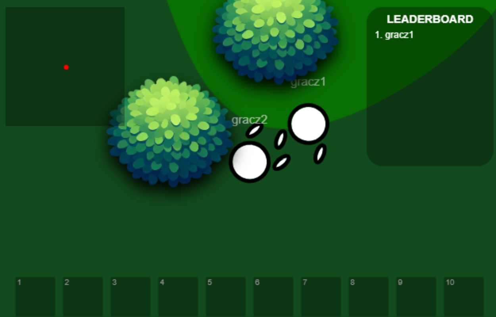

# ForestLife (Krótki opis projektu)

ForestLife to przeglądarkowa gra survivalowa inspirowana grami w stylu .io. Gracze pojawiają się na mapie i muszą przetrwać, korzystając z pozyskanych surowców, budując bazy, zawierając sojusze oraz walcząc z innymi graczami.

<h2>Zrzut ekranu</h2>

Przykładowy zrzut ekranu gry:  

<h2>Instrukcja uruchomienia projektu</h2>

Aby uruchomić projekt lokalnie, wykonaj poniższe kroki:

1. Pobierz projekt: Sklonuj repozytorium lub pobierz paczkę ZIP z projektem.
2. W konsoli przejdź do katalogu projektu.
3. Uruchom serwer (node server/server.js)
4. Uruchom grę w przeglądarce:
Otwórz przeglądarkę i przejdź pod adres:
http://localhost:8080

<h2>Funkcje gry</h2>

- pasek życia, głodu itp.
- pvp,
- możliwość zbierania przedmiotów, craftowania oraz stawiania własnych budowli/budowania bazy,
- minimapa, tabela rankingowa graczy, ekwipunek,
- pojawianie się losowych poruszających się zwierząt

<h2>Zastosowane technologie</h2>

- Node.js
- Express.js
- WebSocket
- UUID
- Modularność
- HTTP
- Path
- JSON

<h2>Szczegóły implementacji</h2>

- Renderowanie: Mapa i obiekty gry są renderowane dynamicznie w czasie rzeczywistym.
- Ruch gracza: Synchronizowany z serwerem, obsługiwany za pomocą klawiatury.
- Obsługa kolizji: Interakcja gracza z obiektami mapy i innymi graczami.
- Animacje: Animacje dla gracza i otoczenia, dostosowywane w zależności od akcji.
- Dynamiczny canvas: Automatyczne dostosowanie rozmiaru pola gry do okna przeglądarki.

<h2>Planowane usprawnienia</h2>

W przyszłości planujemy dodać:

- Więcej rodzajów surowców i budowli.
- Rozbudowane AI dla zwierząt.
- Dodatkowe tryby gry.
- Ulepszenia w interfejsie użytkownika (bardziej zaawansowany ekwipunek i minimapa).

<h2>Licencja</h2>

Projekt jest dostępny na licencji MIT, dzięki czemu możesz go używać, modyfikować i dystrybuować zgodnie z zasadami tej licencji.

<h2>Kontakt:</h2>

Jeśli masz pytania lub propozycje, skontaktuj się ze mną:

**Email:** kacper2019114@gmail.com
**GitHub:** Proxuu